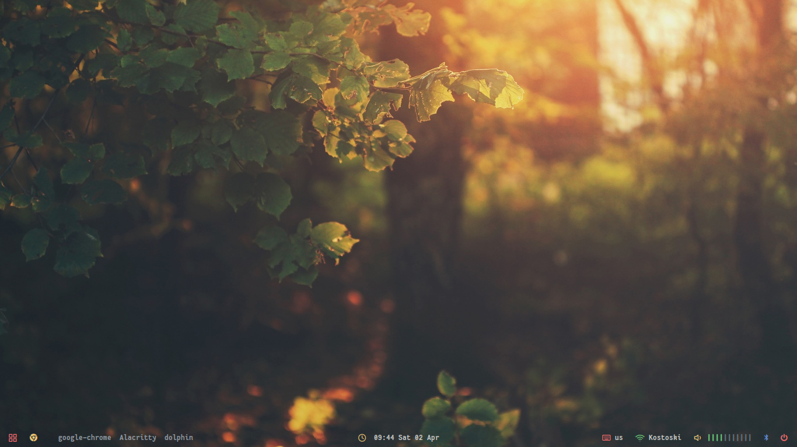

# Openbox setup

### Dependencies
 * openbox
 * polybar
 * rofi
 * alacritty
 * hsetroot
 * numlockx
 * wmctrl
 * obconf
 * parcellite
 * pcmanfm (and gvfs)
 * [gsimplecal](https://github.com/dmedvinsky/gsimplecal)
 * ksuperkey
 * lxappearance
 * pulseaudio (or pipewire-pulse)
 * NetworkManager
 * picom
 * light
 * qt5ct (or qt5ct-kde if using kde apps)
 * [xidlehook-git](https://github.com/jD91mZM2/xidlehook)
 * dunst
 * Fantasque Sans Mono Font
 * Font Awesome
 * Tela Circle Blue Dark icon theme
